# SDD System - Agent Architecture

> Spec-Driven Development 자동화를 위한 AI Agent 시스템 아키텍처

---

## 📋 목차

- [개요](#개요)
- [Phase 기반 Agent 구조](#phase-기반-agent-구조)
- [Agent 상세 명세](#agent-상세-명세)
- [Agent 간 관계도](#agent-간-관계도)
- [실행 흐름](#실행-흐름)
- [단계적 구현 계획](#단계적-구현-계획)
- [Agent 개수 전략](#agent-개수-전략)

---

## 개요

### 설계 원칙

1. **단일 책임**: 각 Agent는 하나의 명확한 책임만 가짐
2. **독립성**: Agent는 독립적으로 동작하며 교체 가능
3. **조합성**: Agent들을 조합하여 복잡한 작업 수행
4. **점진적 확장**: 최소 Agent로 시작해 필요에 따라 추가

### 핵심 개념

```typescript
// Agent의 기본 인터페이스
interface Agent<TInput, TOutput> {
  name: string;
  version: string;
  phase: number;
  dependencies: string[];

  execute(input: TInput): Promise<TOutput>;
  validate(input: TInput): Promise<ValidationResult>;
  rollback?(): Promise<void>;
}
```

---

## Agent 기본 구조

### Base Agent (추상 클래스)

**모든 Agent의 부모 클래스**로, 공통 기능을 제공합니다.

```typescript
// lib/agents/base-agent.ts
export abstract class BaseAgent<TInput, TOutput> {
  protected anthropic: Anthropic;
  protected context: AgentContext;

  public readonly name: string;
  public readonly version: string;

  // 각 Agent가 구현해야 하는 메서드
  abstract execute(input: TInput): Promise<TOutput>;

  // 공통 기능
  protected async callClaude(prompt: string): Promise<string>;
  protected async loadInstructions(): Promise<string>;
  protected extractJSON<T>(response: string): T;
  protected extractCodeBlocks(response: string): Map<string, string>;
  protected log(message: string): void;
}
```

**제공하는 공통 기능:**

1. **`callClaude()`** - Claude API 호출
   - 모델, 온도, 토큰 수 등 설정
   - 에러 처리
   - 로깅

2. **`loadInstructions()`** - AGENT.md 파일 로드
   - 각 Agent 폴더의 AGENT.md 읽기
   - Prompt/Instructions 제공

3. **`extractJSON()`** - 응답에서 JSON 추출
   - 코드 블록 파싱
   - JSON 검증

4. **`extractCodeBlocks()`** - 코드 블록 추출
   - 파일명과 코드 매핑
   - 여러 파일 동시 추출

5. **`log()`** - 로깅
   - Agent별 로그
   - Verbose 모드 지원

### Agent 상속 관계

```
BaseAgent (추상 클래스)
├── Input Validation Agent
├── Spec Parser Agent
├── Architecture Agent
├── Frontend Agent
├── Backend Agent
├── Database Agent
├── Testing Agent
├── Fix Agent
└── ... (모든 Agent)
```

### AGENT.md + TypeScript 패턴

각 Agent는 **두 가지 파일**로 구성됩니다:

```
agents/my-agent/
├── AGENT.md     → Instructions (Claude에게 주는 Prompt)
├── index.ts     → 구현 (BaseAgent 상속)
└── types.ts     → Input/Output 타입
```

**동작 방식:**

```typescript
export class MyAgent extends BaseAgent<MyInput, MyOutput> {
  async execute(input: MyInput): Promise<MyOutput> {
    // 1. AGENT.md 로드 (BaseAgent 제공)
    const instructions = await this.loadInstructions();

    // 2. Prompt 구성
    const prompt = `${instructions}\n\n${JSON.stringify(input)}`;

    // 3. Claude 호출 (BaseAgent 제공)
    const response = await this.callClaude(prompt);

    // 4. 결과 파싱 (BaseAgent 제공)
    return this.extractJSON<MyOutput>(response);
  }
}
```

**장점:**
- ✅ Instructions를 마크다운으로 관리 (수정 용이)
- ✅ 공통 기능 재사용 (DRY)
- ✅ 타입 안전성 (TypeScript)
- ✅ 독립 실행 가능
- ✅ 테스트 용이

---

## Phase 기반 Agent 구조

전체 생성 프로세스를 8개 Phase로 구분하여 체계적으로 진행합니다.

```
Phase 0: 준비         → Spec 검증 및 파싱
Phase 1: 이해 & 설계  → 아키텍처 설계
Phase 2: 기반 구조    → DB, Auth 등 기반
Phase 3: 코어 기능    → API, UI 등 핵심 기능
Phase 4: 품질 보증    → 테스트, 보안
Phase 5: 문서화       → 문서 생성
Phase 6: 배포 준비    → 인프라, CI/CD
Phase 7: 검증 & 수정  → 빌드 검증, 자동 수정
Phase 8: 배포         → 실제 배포
```

### Phase 0: 준비 (Preparation)

**목적**: Spec 파일 검증 및 구조화

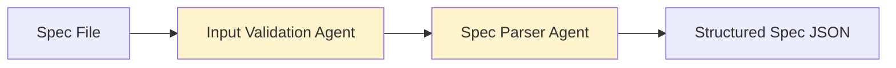

#### 1. Input Validation Agent
- **입력**: Spec 파일 경로
- **출력**: 검증 결과
- **책임**:
  - 파일 존재 확인
  - 기본 마크다운 문법 체크
  - 필수 섹션 존재 확인 (프로젝트 개요, 기능, 기술 스택)

#### 2. Spec Parser Agent
- **입력**: 검증된 Spec 파일
- **출력**: 구조화된 JSON
- **책임**:
  - Spec을 파싱하여 구조화
  - 기능 목록 추출
  - 데이터 모델 추출
  - 기술 스택 정보 추출

**출력 예시**:
```json
{
  "project": {
    "name": "Todo App",
    "description": "간단한 할일 관리 앱"
  },
  "features": [
    { "name": "Todo CRUD", "priority": "high" },
    { "name": "필터링", "priority": "medium" }
  ],
  "techStack": {
    "frontend": "Next.js 14",
    "backend": "Next.js API Routes",
    "database": "PostgreSQL",
    "orm": "Prisma"
  },
  "dataModels": [
    {
      "name": "Todo",
      "fields": [
        { "name": "id", "type": "string" },
        { "name": "title", "type": "string" },
        { "name": "completed", "type": "boolean" }
      ]
    }
  ]
}
```

---

### Phase 1: 이해 & 설계 (Planning)

**목적**: 전체 시스템 아키텍처 설계

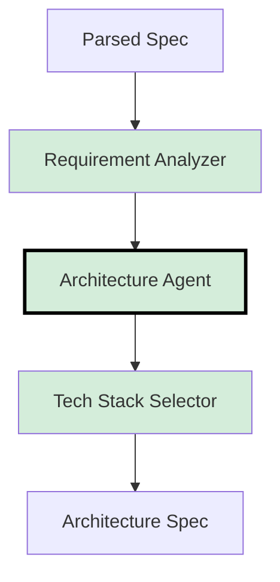

#### 3. Requirement Analyzer Agent
- **입력**: Parsed Spec
- **출력**: 기능 요구사항 분석 결과
- **책임**:
  - 기능 우선순위 분석
  - 복잡도 평가
  - 필요한 외부 서비스 식별

#### 4. Architecture Agent ⭐ (핵심)
- **입력**: 요구사항 분석 결과
- **출력**: 완전한 아키텍처 설계
- **책임**:
  - 전체 시스템 구조 설계
  - 컴포넌트 간 관계 정의
  - 데이터 흐름 설계
  - API 엔드포인트 설계
  - 폴더 구조 설계

**출력 예시**:
```json
{
  "structure": {
    "frontend": {
      "framework": "Next.js 14",
      "pages": ["app/page.tsx", "app/todos/page.tsx"],
      "components": ["TodoList", "TodoItem", "TodoInput"],
      "hooks": ["useTodos", "useLocalStorage"],
      "styling": "Tailwind CSS"
    },
    "backend": {
      "type": "Next.js API Routes",
      "endpoints": [
        { "method": "GET", "path": "/api/todos" },
        { "method": "POST", "path": "/api/todos" },
        { "method": "PUT", "path": "/api/todos/:id" },
        { "method": "DELETE", "path": "/api/todos/:id" }
      ]
    },
    "database": {
      "type": "PostgreSQL",
      "orm": "Prisma",
      "schema": { ... }
    }
  },
  "dependencies": {
    "frontend": ["next@14", "react@18", "tailwindcss@3"],
    "backend": ["@prisma/client", "zod"]
  },
  "folderStructure": {
    "app/": ["page.tsx", "layout.tsx"],
    "components/": ["TodoList.tsx", "TodoItem.tsx"],
    "lib/": ["db.ts", "api.ts"],
    "prisma/": ["schema.prisma"]
  }
}
```

#### 5. Tech Stack Selector Agent
- **입력**: Architecture 초안
- **출력**: 최적화된 기술 스택
- **책임**:
  - 요구사항에 맞는 최적 기술 선택
  - 버전 호환성 검증
  - 대안 기술 제안

---

### Phase 2: 기반 구조 (Foundation)

**목적**: 프로젝트의 뼈대 구성

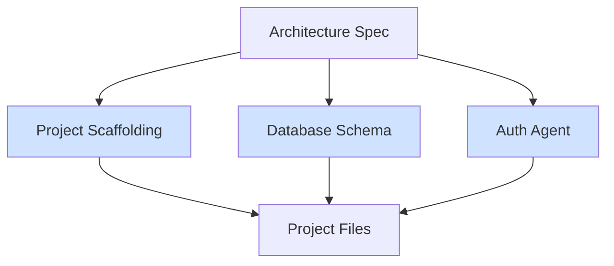

#### 6. Project Scaffolding Agent
- **입력**: Architecture Spec
- **출력**: 기본 프로젝트 구조
- **책임**:
  - 프로젝트 초기화 (package.json, tsconfig.json 등)
  - 폴더 구조 생성
  - 설정 파일 생성
  - 기본 Layout/Root 파일 생성

#### 7. Database Schema Agent
- **입력**: 데이터 모델 정의
- **출력**: DB 스키마 & 마이그레이션 파일
- **책임**:
  - Prisma/TypeORM 스키마 생성
  - 초기 마이그레이션 생성
  - 타입 정의 생성
  - Seed 데이터 생성 (옵션)

#### 8. Auth Agent
- **입력**: 인증 요구사항
- **출력**: 인증 시스템 코드
- **책임**:
  - 인증 로직 생성 (JWT, Session 등)
  - 미들웨어 생성
  - 보호된 라우트 설정
  - 권한 관리 로직

---

### Phase 3: 코어 기능 (Core Features) ⚡ 병렬 실행

**목적**: 핵심 기능 구현

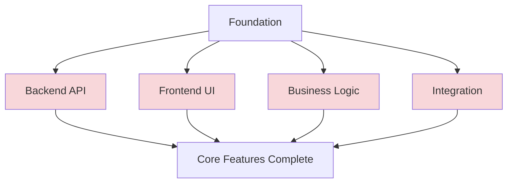

**이 Phase의 Agent들은 병렬로 실행 가능합니다.**

#### 9. Backend API Agent
- **입력**: API 엔드포인트 스펙
- **출력**: API 라우트 코드
- **책임**:
  - RESTful/GraphQL API 생성
  - Request/Response validation
  - Error handling
  - API 문서 주석

**생성 예시**:
```typescript
// app/api/todos/route.ts
import { NextRequest, NextResponse } from 'next/server';
import { prisma } from '@/lib/db';
import { z } from 'zod';

const todoSchema = z.object({
  title: z.string().min(1),
});

export async function GET() {
  try {
    const todos = await prisma.todo.findMany({
      orderBy: { createdAt: 'desc' }
    });
    return NextResponse.json(todos);
  } catch (error) {
    return NextResponse.json(
      { error: 'Failed to fetch todos' },
      { status: 500 }
    );
  }
}

export async function POST(request: NextRequest) {
  try {
    const body = await request.json();
    const { title } = todoSchema.parse(body);

    const todo = await prisma.todo.create({
      data: { title, completed: false }
    });

    return NextResponse.json(todo, { status: 201 });
  } catch (error) {
    if (error instanceof z.ZodError) {
      return NextResponse.json(
        { error: error.errors },
        { status: 400 }
      );
    }
    return NextResponse.json(
      { error: 'Failed to create todo' },
      { status: 500 }
    );
  }
}
```

#### 10. Frontend UI Agent
- **입력**: 페이지 & 컴포넌트 스펙
- **출력**: React/Next.js 컴포넌트
- **책임**:
  - 페이지 컴포넌트 생성
  - UI 컴포넌트 생성
  - 스타일링 (Tailwind CSS 등)
  - 상태 관리
  - API 호출 로직

**생성 예시**:
```typescript
// components/TodoList.tsx
'use client';

import { useState, useEffect } from 'react';
import { TodoItem } from './TodoItem';

interface Todo {
  id: string;
  title: string;
  completed: boolean;
  createdAt: Date;
}

export function TodoList() {
  const [todos, setTodos] = useState<Todo[]>([]);
  const [loading, setLoading] = useState(true);

  useEffect(() => {
    fetchTodos();
  }, []);

  const fetchTodos = async () => {
    try {
      const response = await fetch('/api/todos');
      const data = await response.json();
      setTodos(data);
    } catch (error) {
      console.error('Failed to fetch todos:', error);
    } finally {
      setLoading(false);
    }
  };

  const handleToggle = async (id: string) => {
    // Toggle logic...
  };

  const handleDelete = async (id: string) => {
    // Delete logic...
  };

  if (loading) {
    return <div className="animate-pulse">Loading...</div>;
  }

  return (
    <div className="space-y-2">
      {todos.map(todo => (
        <TodoItem
          key={todo.id}
          todo={todo}
          onToggle={handleToggle}
          onDelete={handleDelete}
        />
      ))}
    </div>
  );
}
```

#### 11. Business Logic Agent
- **입력**: 비즈니스 규칙
- **출력**: 도메인 로직 코드
- **책임**:
  - 비즈니스 규칙 구현
  - 서비스 레이어 생성
  - 도메인 모델 생성
  - 유틸리티 함수

#### 12. Integration Agent
- **입력**: 외부 API 스펙
- **출력**: 통합 코드
- **책임**:
  - 외부 API 클라이언트 생성 (OpenAI, Stripe 등)
  - Webhook 핸들러
  - 에러 처리
  - Rate limiting

---

### Phase 4: 품질 보증 (Quality Assurance)

**목적**: 코드 품질 검증 및 개선

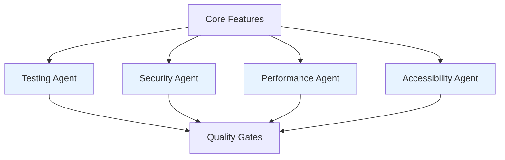

#### 13. Testing Agent
- **입력**: 생성된 코드
- **출력**: 테스트 코드
- **책임**:
  - Unit 테스트 생성
  - Integration 테스트 생성
  - E2E 테스트 생성
  - 테스트 설정 파일 생성

**생성 예시**:
```typescript
// __tests__/api/todos.test.ts
import { describe, it, expect, beforeEach } from 'vitest';
import { GET, POST } from '@/app/api/todos/route';
import { prisma } from '@/lib/db';

describe('Todos API', () => {
  beforeEach(async () => {
    await prisma.todo.deleteMany();
  });

  describe('GET /api/todos', () => {
    it('should return empty array initially', async () => {
      const response = await GET();
      const data = await response.json();

      expect(response.status).toBe(200);
      expect(data).toEqual([]);
    });

    it('should return todos in descending order', async () => {
      await prisma.todo.createMany({
        data: [
          { title: 'First', completed: false },
          { title: 'Second', completed: false }
        ]
      });

      const response = await GET();
      const data = await response.json();

      expect(data).toHaveLength(2);
      expect(data[0].title).toBe('Second');
    });
  });

  describe('POST /api/todos', () => {
    it('should create a new todo', async () => {
      const request = new Request('http://localhost:3000/api/todos', {
        method: 'POST',
        body: JSON.stringify({ title: 'Test Todo' })
      });

      const response = await POST(request);
      const data = await response.json();

      expect(response.status).toBe(201);
      expect(data.title).toBe('Test Todo');
      expect(data.completed).toBe(false);
    });

    it('should validate required fields', async () => {
      const request = new Request('http://localhost:3000/api/todos', {
        method: 'POST',
        body: JSON.stringify({ title: '' })
      });

      const response = await POST(request);

      expect(response.status).toBe(400);
    });
  });
});
```

#### 14. Security Audit Agent
- **입력**: 생성된 코드
- **출력**: 보안 리포트 & 수정 제안
- **책임**:
  - SQL Injection 체크
  - XSS 취약점 검사
  - CSRF 보호 확인
  - 민감 정보 노출 검사
  - 의존성 취약점 검사

#### 15. Performance Agent
- **입력**: 생성된 코드
- **출력**: 성능 최적화 제안
- **책임**:
  - N+1 쿼리 감지
  - 번들 사이즈 분석
  - 불필요한 리렌더링 감지
  - 이미지 최적화 제안

#### 16. Accessibility Agent
- **입력**: Frontend 코드
- **출력**: A11y 리포트 & 수정
- **책임**:
  - ARIA 속성 추가
  - 시맨틱 HTML 검증
  - 키보드 네비게이션 확인
  - 스크린 리더 호환성

---

### Phase 5: 문서화 (Documentation)

**목적**: 포괄적인 문서 생성

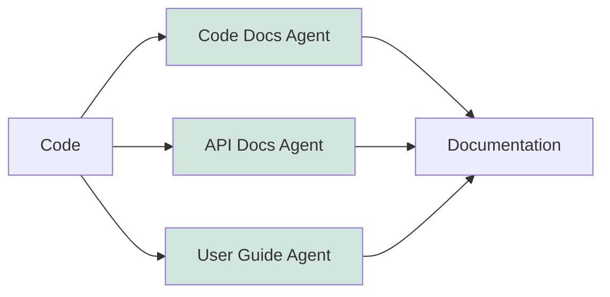

#### 17. Code Documentation Agent
- **입력**: 생성된 코드
- **출력**: JSDoc, README
- **책임**:
  - 함수/클래스 JSDoc 추가
  - README.md 생성
  - 환경 변수 문서화
  - 개발 가이드 생성

#### 18. API Documentation Agent
- **입력**: API 코드
- **출력**: OpenAPI/Swagger 문서
- **책임**:
  - OpenAPI 스펙 생성
  - Swagger UI 설정
  - API 예제 생성

#### 19. User Guide Agent
- **입력**: 전체 프로젝트
- **출력**: 사용자 가이드
- **책임**:
  - 기능 설명 문서
  - 스크린샷/다이어그램 제안
  - FAQ 생성

---

### Phase 6: 배포 준비 (Deployment Preparation)

**목적**: 프로덕션 환경 설정

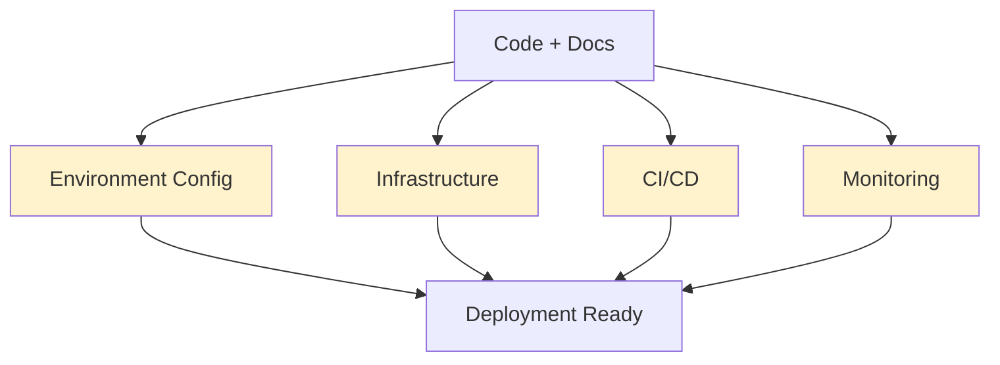

#### 20. Environment Config Agent
- **입력**: 프로젝트 요구사항
- **출력**: 환경 설정 파일
- **책임**:
  - .env.example 생성
  - 환경별 설정 (.env.development, .env.production)
  - 환경 변수 검증 코드

#### 21. Infrastructure Agent
- **입력**: 배포 플랫폼 정보
- **출력**: 인프라 설정
- **책임**:
  - Docker/Docker Compose 설정
  - Kubernetes 매니페스트 (옵션)
  - Serverless 설정 (Vercel, Railway 등)

**생성 예시** (Vercel):
```json
// vercel.json
{
  "buildCommand": "npm run build",
  "devCommand": "npm run dev",
  "installCommand": "npm install",
  "framework": "nextjs",
  "env": {
    "DATABASE_URL": "@database-url",
    "NEXTAUTH_SECRET": "@nextauth-secret"
  }
}
```

#### 22. CI/CD Agent
- **입력**: 프로젝트 구조
- **출력**: CI/CD 파이프라인
- **책임**:
  - GitHub Actions 워크플로우
  - 자동 테스트 실행
  - 자동 배포 설정
  - 릴리스 노트 생성

**생성 예시**:
```yaml
# .github/workflows/deploy.yml
name: Deploy to Production

on:
  push:
    branches: [main]

jobs:
  test:
    runs-on: ubuntu-latest
    steps:
      - uses: actions/checkout@v3
      - uses: actions/setup-node@v3
        with:
          node-version: '20'
      - run: npm ci
      - run: npm run test
      - run: npm run type-check
      - run: npm run lint

  deploy:
    needs: test
    runs-on: ubuntu-latest
    steps:
      - uses: actions/checkout@v3
      - uses: amondnet/vercel-action@v20
        with:
          vercel-token: ${{ secrets.VERCEL_TOKEN }}
          vercel-org-id: ${{ secrets.ORG_ID }}
          vercel-project-id: ${{ secrets.PROJECT_ID }}
          vercel-args: '--prod'
```

#### 23. Monitoring Agent
- **입력**: 프로젝트 정보
- **출력**: 모니터링 설정
- **책임**:
  - Sentry 설정
  - Analytics 설정 (Google Analytics, Posthog 등)
  - 로깅 설정
  - Health check 엔드포인트

---

### Phase 7: 검증 & 수정 (Validation & Fix)

**목적**: 최종 검증 및 자동 수정

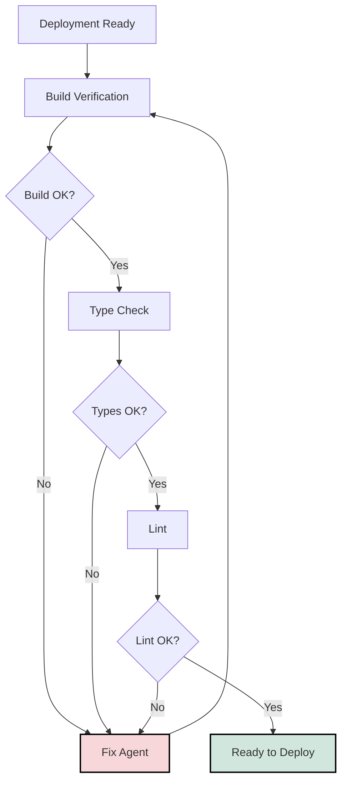

#### 24. Build Verification Agent
- **입력**: 전체 프로젝트
- **출력**: 빌드 결과
- **책임**:
  - `npm run build` 실행
  - 빌드 에러 수집
  - 에러 분석

#### 25. Type Check Agent
- **입력**: TypeScript 코드
- **출력**: 타입 체크 결과
- **책임**:
  - `tsc --noEmit` 실행
  - 타입 에러 수집
  - 타입 에러 분석

#### 26. Lint Agent
- **입력**: 전체 코드
- **출력**: Lint 결과
- **책임**:
  - ESLint 실행
  - Prettier 검사
  - 코드 스타일 검증

#### 27. Fix Agent ⭐ (중요!)
- **입력**: 에러 리포트 (빌드/타입/린트)
- **출력**: 수정된 코드
- **책임**:
  - 에러 원인 분석
  - 자동 수정 시도
  - 수정 불가능한 경우 제안 제공

**동작 방식**:
```typescript
// Fix Agent의 동작 예시
async function fixErrors(errors: Error[]): Promise<FixResult> {
  for (const error of errors) {
    const analysis = await analyzeError(error);

    if (analysis.autoFixable) {
      await applyFix(analysis.fix);
    } else {
      // LLM에게 수정 요청
      const fix = await llm.generateFix({
        error: error.message,
        file: error.file,
        context: await readFile(error.file)
      });

      await applyFix(fix);
    }
  }

  // 재검증
  return await revalidate();
}
```

---

### Phase 8: 배포 (Deployment)

**목적**: 실제 배포 실행

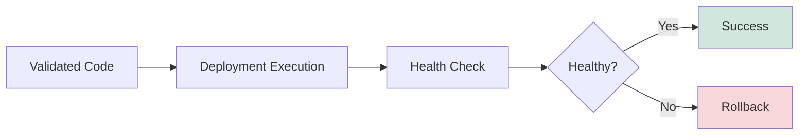

#### 28. Deployment Execution Agent
- **입력**: 검증 완료된 프로젝트
- **출력**: 배포 URL & 상태
- **책임**:
  - 실제 배포 실행
  - 환경 변수 설정
  - 데이터베이스 마이그레이션
  - Health check
  - 배포 실패 시 롤백

---

## Agent 간 관계도

### 전체 흐름

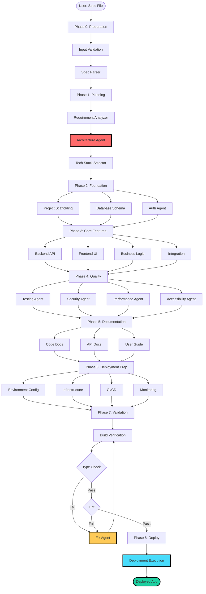

### 의존성 그래프

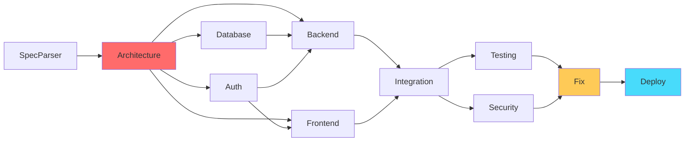

---

## 실행 흐름

### 순차 실행이 필요한 Phase

```
Phase 0 → Phase 1 → Phase 2 → Phase 3
```

각 Phase가 이전 Phase의 출력에 의존합니다.

### 병렬 실행 가능한 Agent

**Phase 3 (Core Features)**:
```typescript
await Promise.all([
  backendAgent.execute(),
  frontendAgent.execute(),
  businessLogicAgent.execute(),
  integrationAgent.execute()
]);
```

**Phase 4 (Quality)**:
```typescript
await Promise.all([
  testingAgent.execute(),
  securityAgent.execute(),
  performanceAgent.execute(),
  accessibilityAgent.execute()
]);
```

**Phase 5 (Documentation)**:
```typescript
await Promise.all([
  codeDocsAgent.execute(),
  apiDocsAgent.execute(),
  userGuideAgent.execute()
]);
```

**Phase 6 (Deployment Prep)**:
```typescript
await Promise.all([
  envConfigAgent.execute(),
  infraAgent.execute(),
  cicdAgent.execute(),
  monitoringAgent.execute()
]);
```

### Orchestrator 실행 예시

```typescript
// lib/orchestrator.ts
export class Orchestrator {
  async execute(specFile: string): Promise<GeneratedApp> {
    // Phase 0: Preparation
    const validated = await this.inputValidationAgent.execute(specFile);
    const parsed = await this.specParserAgent.execute(validated);

    // Phase 1: Planning
    const requirements = await this.requirementAnalyzer.execute(parsed);
    const architecture = await this.architectureAgent.execute(requirements);
    const techStack = await this.techStackSelector.execute(architecture);

    // Phase 2: Foundation (순차)
    const scaffolded = await this.projectScaffoldingAgent.execute(architecture);
    const dbSchema = await this.databaseSchemaAgent.execute(architecture);
    const auth = await this.authAgent.execute(architecture);

    // Phase 3: Core Features (병렬)
    const [backend, frontend, business, integration] = await Promise.all([
      this.backendAgent.execute(architecture),
      this.frontendAgent.execute(architecture),
      this.businessLogicAgent.execute(architecture),
      this.integrationAgent.execute(architecture)
    ]);

    // Phase 4: Quality (병렬)
    const [tests, security, perf, a11y] = await Promise.all([
      this.testingAgent.execute({ backend, frontend }),
      this.securityAgent.execute({ backend, frontend }),
      this.performanceAgent.execute({ backend, frontend }),
      this.a11yAgent.execute({ frontend })
    ]);

    // Phase 5: Documentation (병렬)
    const [codeDocs, apiDocs, userGuide] = await Promise.all([
      this.codeDocsAgent.execute({ backend, frontend }),
      this.apiDocsAgent.execute({ backend }),
      this.userGuideAgent.execute({ frontend })
    ]);

    // Phase 6: Deployment Prep (병렬)
    const [envConfig, infra, cicd, monitoring] = await Promise.all([
      this.envConfigAgent.execute(architecture),
      this.infraAgent.execute(architecture),
      this.cicdAgent.execute(architecture),
      this.monitoringAgent.execute(architecture)
    ]);

    // Phase 7: Validation & Fix (순차, 반복 가능)
    let buildOk = false;
    let attempts = 0;
    const maxAttempts = 3;

    while (!buildOk && attempts < maxAttempts) {
      const buildResult = await this.buildVerificationAgent.execute();

      if (buildResult.success) {
        const typeResult = await this.typeCheckAgent.execute();

        if (typeResult.success) {
          const lintResult = await this.lintAgent.execute();

          if (lintResult.success) {
            buildOk = true;
          } else {
            await this.fixAgent.execute(lintResult.errors);
          }
        } else {
          await this.fixAgent.execute(typeResult.errors);
        }
      } else {
        await this.fixAgent.execute(buildResult.errors);
      }

      attempts++;
    }

    if (!buildOk) {
      throw new Error('Failed to build after maximum attempts');
    }

    // Phase 8: Deployment
    const deployment = await this.deploymentAgent.execute();

    return {
      url: deployment.url,
      files: this.collectAllFiles(),
      metadata: {
        phases: 8,
        agents: 28,
        duration: Date.now() - startTime
      }
    };
  }
}
```

---

## 단계적 구현 계획

### Step 1: MVP (3 Core Agents) - 1-2주

**목표**: 하나의 앱이라도 끝까지 생성

```typescript
Agent 1: Spec Parser
Agent 2: Architecture
Agent 3: Simple Code Generator (Frontend + Backend 통합)
```

**산출물**: 동작하는 Todo App 1개

---

### Step 2: 분리 (6 Agents) - 2-3주

**목표**: Agent 전문화

```typescript
Agent 1: Spec Parser (유지)
Agent 2: Architecture (유지)
Agent 4: Frontend Agent
Agent 5: Backend Agent
Agent 6: Database Agent
Agent 7: Deployment Agent
```

**산출물**:
- Todo App
- Blog App
- Simple Dashboard

---

### Step 3: 품질 (9 Agents) - 1-2주

**목표**: 코드 품질 향상

```typescript
기존 6개 +
Agent 8: Testing Agent
Agent 9: Validation Agent
Agent 10: Fix Agent
```

**산출물**: 테스트 포함된 프로덕션급 앱

---

### Step 4: 확장 (15+ Agents) - 계속

**목표**: 완전한 시스템

```typescript
기존 9개 +
Agent 11: Auth Agent
Agent 12: Integration Agent
Agent 13: Security Agent
Agent 14: Documentation Agent
Agent 15: CI/CD Agent
...
```

**산출물**: 엔터프라이즈급 앱 자동 생성

---

## Agent 개수 전략

### Minimal (MVP): 3 Agents
```
✅ 동작하는 앱 생성 가능
✅ 빠른 검증
⚠️ 코드 품질 낮음
⚠️ 확장성 제한
```

### Recommended (Production): 10-15 Agents
```
✅ 프로덕션급 코드
✅ 테스트 포함
✅ 문서화
✅ CI/CD 자동화
⚠️ 복잡도 증가
```

### Complete (Enterprise): 25-30 Agents
```
✅ 엔터프라이즈급
✅ 완전한 자동화
✅ 보안, 성능, A11y 모두 포함
⚠️ 구현 시간 많이 소요
⚠️ 유지보수 복잡
```

---

## 다음 단계

### 즉시 시작 가능

1. **Step 1 구현**: 3 Core Agents
   ```bash
   cd /Users/jaykim/Documents/Projects/sdd-system

   # 구현할 파일들
   lib/agents/spec-parser.ts
   lib/agents/architecture.ts
   lib/agents/code-generator.ts
   ```

2. **첫 테스트**: Simple Todo App
   ```bash
   specs/simple-todo.md → output/todo-app/
   ```

3. **검증**: 생성된 앱 실행
   ```bash
   cd output/todo-app
   npm install
   npm run dev
   ```

---

## 참고

- **유사 시스템**: v0.dev, bolt.new, cursor
- **핵심 기술**: Claude API, TypeScript, Node.js
- **테스트 프로젝트**: voice-journal (참고용)

---

**Version**: 1.0.0
**Last Updated**: 2025-12-13
**Status**: Design Complete → Ready for Implementation
