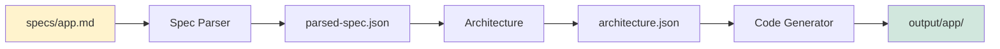

# SDD System - Spec-Driven Development Automation

> AI Agent 기반 애플리케이션 자동 생성 시스템

Specification(명세서)를 작성하면 AI Agent들이 자동으로 완전한 웹 애플리케이션을 생성합니다.

---

## 📋 목차

- [개요](#개요)
- [프로젝트 구조](#프로젝트-구조)
- [워크플로우](#워크플로우)
- [Quick Start](#quick-start)
- [사용 예시](#사용-예시)
- [Agent 아키텍처](#agent-아키텍처)
- [문서](#문서)

---

## 개요

### 핵심 개념

```
Spec (명세서) → AI Agents → 완전한 앱
```

**Input**: Markdown 형식의 애플리케이션 명세서
**Process**: AI Agent들이 단계적으로 코드 생성
**Output**: 즉시 실행 가능한 Next.js/React 앱

### 특징

- ✅ **Spec-Driven**: 명세서만 작성하면 코드 자동 생성
- ✅ **AI-Powered**: Claude Sonnet 4.5 기반 Agent 시스템
- ✅ **완전 자동화**: 프로젝트 구조부터 배포까지
- ✅ **프로덕션 품질**: TypeScript, 테스트, 문서 포함
- ✅ **점진적 확장**: 3개 Core Agent로 시작 → 필요시 확장

---

## 📁 프로젝트 구조

```
sdd-system/                          # SDD 시스템 루트
├── lib/
│   └── agents/                      # ✅ Agent 구현 위치
│       ├── base-agent.ts           # Base Agent 추상 클래스
│       │
│       ├── spec-parser/            # Spec Parser Agent
│       │   ├── AGENT.md           # Claude Instructions
│       │   ├── index.ts           # TypeScript 구현
│       │   └── types.ts           # Input/Output 타입
│       │
│       ├── architecture/           # Architecture Agent
│       │   ├── AGENT.md
│       │   ├── index.ts
│       │   └── types.ts
│       │
│       └── code-generator/         # Code Generator Agent
│           ├── AGENT.md
│           ├── index.ts
│           └── types.ts
│
├── specs/                          # 📝 입력: Spec 파일 위치
│   ├── voice-journal-web.md       # Voice Journal 웹 버전 Spec
│   └── todo-app.md                # Todo App Spec (예시)
│
├── .temp/                          # 🔄 중간 산출물 (자동 생성)
│   ├── parsed-spec.json           # Spec Parser 출력
│   └── architecture.json          # Architecture Agent 출력
│
├── output/                         # 🎁 출력: 생성된 앱 위치
│   ├── voice-journal-web/         # 생성된 Voice Journal 앱
│   │   ├── app/                   # Next.js app directory
│   │   ├── components/            # React 컴포넌트
│   │   ├── lib/                   # 유틸리티
│   │   ├── package.json           # 독립 프로젝트!
│   │   ├── tsconfig.json
│   │   └── ...                    # 완전한 Next.js 프로젝트
│   │
│   └── todo-app/                  # 생성된 Todo App
│       └── ...
│
├── docs/                           # Agent용 참고 문서
│   └── architecture.md
│
├── cli.ts                          # 🚀 CLI 진입점
├── package.json                    # SDD 시스템 의존성
├── tsconfig.json
├── README.md                       # 이 파일
├── AGENT_ARCHITECTURE.md           # Agent 상세 설계
├── IMPLEMENTATION_GUIDE.md         # Agent 구현 가이드
└── .env                            # API Keys
```

### 각 폴더의 역할 상세

| 폴더/파일 | 역할 | Git 관리 | 상세 설명 |
|-----------|------|----------|----------|
| **`lib/agents/`** | Agent 구현 | ✅ 추적 | TypeScript로 작성된 Agent 코드<br>• Base Agent 추상 클래스<br>• 각 Agent별 AGENT.md + index.ts + types.ts |
| **`specs/`** | 입력 Spec | ✅ 추적 | 사용자가 작성하는 Markdown 명세서<br>• 앱 기능, 기술 스택, 데이터 모델 정의<br>• 파일명이 생성될 앱 이름이 됨 |
| **`.temp/`** | 중간 산출물 | ❌ 제외 | Agent 간 데이터 전달용 JSON 파일<br>• 자동 생성됨<br>• 디버깅 시 유용 |
| **`output/`** | 생성된 앱 | ❌ 제외 | 완전한 독립 프로젝트 (즉시 실행 가능)<br>• `pnpm install && pnpm dev` 바로 가능<br>• 별도 Git 저장소로 관리 권장 |
| **`docs/`** | 참고 문서 | ✅ 추적 | Agent용 참고 자료 |
| **`cli.ts`** | CLI 도구 | ✅ 추적 | 진입점 (`pnpm generate`)<br>• Agent Orchestrator 실행<br>• 로깅 및 에러 처리 |

### 데이터 흐름

```
사용자 작성                Agent 실행              최종 결과
    ↓                         ↓                      ↓
[specs/]        →      [.temp/]         →      [output/]
my-app.md              parsed-spec.json        my-app/
                       architecture.json       ├── app/
                                               ├── components/
                                               └── ...
```

### Agent 구조 (AGENT.md + TypeScript)

각 Agent는 두 파일로 구성됩니다:

```
agents/spec-parser/
├── AGENT.md      # Instructions (Claude에게 주는 지시사항)
├── index.ts      # 실제 구현 (TypeScript)
└── types.ts      # 타입 정의
```

**AGENT.md**: Agent의 역할, 지시사항, 예시를 Markdown으로 작성
**index.ts**: 실제 로직 구현 (Claude API 호출, 파일 I/O 등)

---

## 🔄 워크플로우

### 전체 흐름

```
1. Spec 작성
   specs/my-app.md
   │
   ↓
2. SDD 시스템 실행
   pnpm generate specs/my-app.md
   │
   ↓
3. Agent들이 순차적으로 실행
   Spec Parser → Architecture → Code Generator
   │
   ↓
4. 완전한 앱 생성
   output/my-app/
   ├── 프로젝트 구조 ✅
   ├── 모든 코드 파일 ✅
   ├── package.json ✅
   └── 설정 파일 ✅
   │
   ↓
5. 생성된 앱 실행
   cd output/my-app
   pnpm install && pnpm dev
```

### Agent 실행 단계 상세

#### Phase 0: Spec Parser Agent

**역할**: Markdown Spec → 구조화된 JSON

```bash
Input:  specs/my-app.md
        ↓ (AGENT.md Instructions 로드)
        ↓ (Claude API 호출)
Output: .temp/parsed-spec.json
```

**출력 예시** (`.temp/parsed-spec.json`):
```json
{
  "projectName": "my-app",
  "description": "간단한 Todo 앱",
  "features": ["Todo 추가", "Todo 완료", "Todo 삭제"],
  "techStack": {
    "frontend": "Next.js 14",
    "styling": "Tailwind CSS"
  },
  "dataModels": [...]
}
```

---

#### Phase 1: Architecture Agent

**역할**: 프로젝트 구조 설계

```bash
Input:  .temp/parsed-spec.json
        ↓ (프로젝트 구조 설계)
        ↓ (파일 목록 생성)
Output: .temp/architecture.json
```

**출력 예시** (`.temp/architecture.json`):
```json
{
  "projectStructure": {
    "app/": ["page.tsx", "layout.tsx"],
    "components/": ["TodoList.tsx", "TodoItem.tsx"],
    "lib/": ["api.ts", "types.ts"]
  },
  "dependencies": {
    "next": "14.0.0",
    "tailwindcss": "3.3.0"
  }
}
```

---

#### Phase 2: Code Generator Agent

**역할**: 실제 코드 파일 생성

```bash
Input:  .temp/architecture.json
        ↓ (파일별 코드 생성)
        ↓ (파일 시스템에 쓰기)
Output: output/my-app/
        ├── app/page.tsx
        ├── components/TodoList.tsx
        ├── package.json
        └── ...
```

---

### CLI 실행 예시

```bash
$ pnpm generate specs/voice-journal-web.md

🚀 SDD System - Starting...

📝 Phase 0: Spec Parser Agent
   Reading: specs/voice-journal-web.md
   Parsing specification...
   ✅ Generated: .temp/parsed-spec.json

🏗️  Phase 1: Architecture Agent
   Designing project structure...
   Planning components and routes...
   ✅ Generated: .temp/architecture.json

💻 Phase 2: Code Generator Agent
   Generating app/page.tsx...
   Generating components/VoiceRecorder.tsx...
   Generating lib/api/journals.ts...
   Creating package.json...
   ✅ Generated: output/voice-journal-web/

🎉 Success! Your app is ready at: output/voice-journal-web

Next steps:
  cd output/voice-journal-web
  pnpm install
  pnpm dev
```

---

### 파일 흐름 다이어그램

```
┌─────────────────────────────────────────────┐
│  사용자: Spec 작성                          │
│  specs/voice-journal-web.md                │
└─────────────────────────────────────────────┘
                    ↓
┌─────────────────────────────────────────────┐
│  CLI 실행                                   │
│  pnpm generate specs/voice-journal-web.md  │
└─────────────────────────────────────────────┘
                    ↓
┌─────────────────────────────────────────────┐
│  Phase 0: Spec Parser Agent                │
│  Input:  specs/voice-journal-web.md        │
│  Output: .temp/parsed-spec.json            │
└─────────────────────────────────────────────┘
                    ↓
┌─────────────────────────────────────────────┐
│  Phase 1: Architecture Agent               │
│  Input:  .temp/parsed-spec.json            │
│  Output: .temp/architecture.json           │
└─────────────────────────────────────────────┘
                    ↓
┌─────────────────────────────────────────────┐
│  Phase 2: Code Generator Agent             │
│  Input:  .temp/architecture.json           │
│  Output: output/voice-journal-web/         │
│          ├── app/                          │
│          ├── components/                   │
│          ├── lib/                          │
│          └── package.json                  │
└─────────────────────────────────────────────┘
                    ↓
┌─────────────────────────────────────────────┐
│  사용자: 생성된 앱 실행                     │
│  cd output/voice-journal-web               │
│  pnpm install && pnpm dev                  │
└─────────────────────────────────────────────┘
```

---

## 🚀 Quick Start

### 1. 설치

```bash
# 저장소 클론
git clone https://github.com/your-username/sdd-system.git
cd sdd-system

# 의존성 설치
pnpm install
```

### 📟 CLI 명령어 레퍼런스

| 명령어 | 설명 | 사용 예시 |
|--------|------|----------|
| `pnpm install` | SDD 시스템 의존성 설치 | `pnpm install` |
| `pnpm generate <spec-file>` | Spec 파일로부터 앱 생성 | `pnpm generate specs/my-app.md` |
| `pnpm dev <spec-file>` | Watch 모드로 개발 (상세 로그) | `pnpm dev specs/my-app.md` |
| `pnpm build` | TypeScript 컴파일 | `pnpm build` |
| `pnpm test` | Agent 단위 테스트 실행 | `pnpm test` |

**주요 명령어 상세:**

- **`pnpm generate`**: Spec 파일을 읽어 Agent들을 순차 실행하여 완전한 앱을 `output/` 폴더에 생성
- **`pnpm dev`**: Watch 모드로 실행. 파일 변경 시 자동 재실행. 상세한 로깅 제공
- **생성된 앱 명령어** (output/ 내부):
  - `pnpm install`: 생성된 앱의 의존성 설치
  - `pnpm dev`: Next.js 개발 서버 시작 (http://localhost:3000)
  - `pnpm build`: 프로덕션 빌드
  - `pnpm start`: 프로덕션 서버 시작

### 2. 환경 설정

```bash
# 환경변수 파일 생성
cp .env.example .env

# .env 파일 편집
vim .env
```

```.env
# Anthropic API Key (필수)
ANTHROPIC_API_KEY=your_api_key_here
```

### 3. Spec 작성

```bash
# 새 Spec 파일 생성
vim specs/my-first-app.md
```

**specs/my-first-app.md** 예시:
```markdown
# My First App

간단한 Todo 애플리케이션

## 핵심 기능

- Todo 추가
- Todo 완료 체크
- Todo 삭제

## 기술 스택

- Frontend: Next.js 14
- Styling: Tailwind CSS
- Database: Local Storage

## 데이터 모델

\`\`\`typescript
interface Todo {
  id: string;
  title: string;
  completed: boolean;
}
\`\`\`
```

### 4. 앱 생성

```bash
# SDD 시스템 실행
pnpm generate specs/my-first-app.md

# 또는 개발 모드 (상세 로그)
pnpm dev specs/my-first-app.md
```

### 5. 생성된 앱 실행

```bash
# 생성된 앱 디렉토리로 이동
cd output/my-first-app

# 의존성 설치
pnpm install

# 개발 서버 시작
pnpm dev
```

브라우저에서 `http://localhost:3000` 열기 → 앱 실행 중! 🎉

---

## 💻 사용 예시

### 예시 1: 간단한 앱 생성

```bash
# Todo App 생성
pnpm generate specs/todo-app.md
# → output/todo-app/

cd output/todo-app
pnpm install
pnpm dev
```

### 예시 2: 복잡한 앱 생성 (Voice Journal)

```bash
# Voice Journal 웹 버전 생성
pnpm generate specs/voice-journal-web.md
# → output/voice-journal-web/
#    ├── 인증 시스템 ✅
#    ├── AI 감정 분석 ✅
#    ├── 차트 시각화 ✅
#    └── Supabase 연동 ✅

cd output/voice-journal-web
pnpm install
pnpm dev
```

### 예시 3: 여러 버전 비교

```bash
# v1 생성
pnpm generate specs/app-v1.md
# → output/app-v1/

# v2 생성
pnpm generate specs/app-v2.md
# → output/app-v2/

# 차이점 비교
diff -r output/app-v1 output/app-v2
```

### 예시 4: 생성된 앱 배포

```bash
# 생성된 앱을 독립 프로젝트로 복사
cp -r output/my-app ~/Projects/my-app
cd ~/Projects/my-app

# Git 초기화
git init
git add .
git commit -m "Initial commit from SDD System"

# Vercel 배포
vercel deploy
```

---

## 🏗️ Agent 아키텍처

### Base Agent (추상 클래스)

모든 Agent는 `BaseAgent` 추상 클래스를 상속합니다:

```typescript
export abstract class BaseAgent<TInput, TOutput> {
  protected anthropic: Anthropic;        // Claude API 클라이언트
  protected context: AgentContext;       // 실행 컨텍스트
  public readonly name: string;          // Agent 이름
  public readonly version: string;       // Agent 버전

  // 각 Agent가 구현해야 하는 메서드
  abstract execute(input: TInput): Promise<TOutput>;

  // 공통 유틸리티 메서드
  protected async callClaude(prompt: string): Promise<string>;
  protected async loadInstructions(): Promise<string>;
  protected extractJSON<T>(response: string): T;
  protected extractCodeBlocks(response: string): Map<string, string>;
  protected log(message: string): void;
}
```

**Base Agent가 제공하는 공통 기능**:
1. `callClaude()` - Claude API 호출 및 응답 받기
2. `loadInstructions()` - AGENT.md 파일 로드
3. `extractJSON()` - Claude 응답에서 JSON 추출
4. `extractCodeBlocks()` - Claude 응답에서 코드 블록 추출
5. `log()` - 구조화된 로깅

### Agent 구조 (AGENT.md + TypeScript)

각 Agent는 두 파일로 구성됩니다:
- **AGENT.md**: Claude에게 주는 Instructions (역할, 지시사항, 예시)
- **index.ts**: TypeScript 구현 (Claude API 호출, 파일 I/O, 데이터 처리)
- **types.ts**: Input/Output 타입 정의

### Step 1: Core Agents (현재 구현 중)

```
1. Spec Parser Agent
   - Spec 파일을 읽어서 구조화된 JSON으로 변환
   - BaseAgent를 상속

2. Architecture Agent
   - 전체 프로젝트 아키텍처 설계
   - 폴더 구조, 파일 목록, 의존성 결정
   - BaseAgent를 상속

3. Code Generator Agent
   - 실제 코드 생성 (Frontend + Backend)
   - 파일 시스템에 쓰기
   - BaseAgent를 상속
```

### Step 2: 전문화 (향후 계획)

```
4. Frontend Agent       - UI 컴포넌트 전문
5. Backend Agent        - API 엔드포인트 전문
6. Database Agent       - Prisma 스키마
7. Testing Agent        - 테스트 코드 생성
8. Documentation Agent  - README, API 문서
9. Deployment Agent     - Vercel/Railway 배포
```

### Agent 간 데이터 흐름



---

## 📚 문서

- **[AGENT_ARCHITECTURE.md](./AGENT_ARCHITECTURE.md)** - Agent 시스템 상세 설계
  - Phase 기반 구조
  - 28개 Agent 명세
  - 실행 흐름
  - 구현 예시

- **[docs/architecture.md](./docs/architecture.md)** - 시스템 아키텍처 문서

---

## 🛠️ 개발

### 새 Agent 추가하기

1. **폴더 생성**
   ```bash
   mkdir -p lib/agents/my-agent
   cd lib/agents/my-agent
   ```

2. **AGENT.md 작성** (Instructions)
   ```markdown
   # My Agent

   Agent description...

   ## Instructions

   You are a specialized agent that...
   ```

3. **index.ts 구현**
   ```typescript
   import { BaseAgent } from '../base-agent';

   export class MyAgent extends BaseAgent {
     async execute(input: MyInput): Promise<MyOutput> {
       // 구현
     }
   }
   ```

4. **types.ts 정의**
   ```typescript
   export interface MyInput {
     // 입력 타입
   }

   export interface MyOutput {
     // 출력 타입
   }
   ```

### 테스트

```bash
# 단위 테스트
pnpm test

# 통합 테스트 (실제 앱 생성)
pnpm test:integration
```

---

## 🤝 기여하기

1. Fork the Project
2. Create your Feature Branch (`git checkout -b feature/AmazingFeature`)
3. Commit your Changes (`git commit -m 'Add some AmazingFeature'`)
4. Push to the Branch (`git push origin feature/AmazingFeature`)
5. Open a Pull Request

---

## 📄 라이센스

MIT License

---

## 🙋 FAQ

### Q: output/ 폴더를 Git에 포함해야 하나요?

**A**: 아니요. `output/`은 생성물이므로 `.gitignore`에 추가하세요.

```gitignore
# .gitignore
output/
node_modules/
.env
```

생성된 앱을 저장하려면 별도 저장소로 복사하세요.

---

### Q: 생성된 앱을 수정할 수 있나요?

**A**: 네! `output/my-app/`은 완전히 독립적인 프로젝트입니다.
- 자유롭게 수정 가능
- 별도 Git 저장소로 관리 가능
- 수정 후 재생성하면 덮어씌워지므로 주의!

---

### Q: 어떤 종류의 앱을 생성할 수 있나요?

**A**: 현재 Step 1 (MVP) 단계에서는:
- ✅ Next.js 14 (App Router) 웹앱
- ✅ TypeScript 기반
- ✅ Tailwind CSS 스타일링
- ✅ Supabase 연동
- ✅ OpenAI API 통합

향후 확장 가능:
- React Native 모바일 앱
- GraphQL API
- 다른 프레임워크 (Vue, Svelte 등)

---

### Q: API 키는 어디서 받나요?

**A**:
- **Anthropic API Key**: https://console.anthropic.com/
- Claude Sonnet 4.5 사용 권장
- 무료 크레딧으로 테스트 가능

---

## 🔗 링크

- [Anthropic Claude API](https://docs.anthropic.com/)
- [Next.js Documentation](https://nextjs.org/docs)
- [Supabase](https://supabase.com/)

---

**Version**: 1.0.0 (Step 1 - Core Agents)
**Status**: ✅ Stable
**Last Updated**: 2025-12-14
